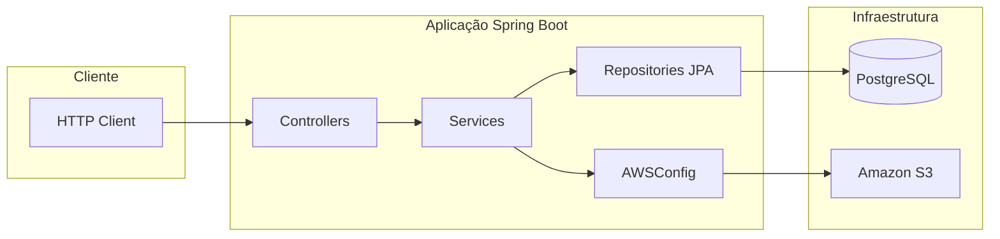

# EventTech API

Backend REST para cadastro e consulta de **eventos**, com upload de imagens no **Amazon S3**, persistência em **PostgreSQL** e evolução de schema via **Flyway**. Projeto de estudo construído com **Spring Boot 3** e **Java 21**.

> **Deploy na AWS validado:** a stack foi exercida de ponta a ponta com **EC2** (API), **RDS PostgreSQL** (dados), **S3** (mídia) e acesso à instância por **SSH**. Criação de evento com imagem, gravação no banco e listagem foram testadas com sucesso contra o ambiente na nuvem.

---

## Sumário

- [Visão geral](#visão-geral)
- [Funcionalidades](#funcionalidades)
- [Stack tecnológica](#stack-tecnológica)
- [Arquitetura](#arquitetura)
- [Modelo de domínio e dados](#modelo-de-domínio-e-dados)
- [Estrutura do repositório](#estrutura-do-repositório)
- [Pré-requisitos](#pré-requisitos)
- [Configuração e variáveis de ambiente](#configuração-e-variáveis-de-ambiente)
- [Como executar](#como-executar)
- [Docker Compose (Postgres + API)](#docker-compose-postgres--api)
- [Documentação OpenAPI (Swagger)](#documentação-openapi-swagger)
- [API HTTP](#api-http)
- [Erros da API (JSON padronizado)](#erros-da-api-json-padronizado)
- [Testes](#testes)
- [CI (GitHub Actions)](#ci-github-actions)
- [Contribuição e setup](#contribuição-e-setup)
- [Deploy na AWS (guia)](#deploy-na-aws-guia)
- [Segurança e publicação no GitHub](#segurança-e-publicação-no-github)
- [Licença](#licença)

---

## Visão geral

A API expõe recursos sob `/api/event` e `/api/coupon`, seguindo uma arquitetura em **camadas** clássica (web → serviço → persistência). O fluxo principal de negócio é o **evento**: pode ser remoto ou presencial; se presencial, há vínculo opcional com **endereço**; **cupons** associam-se a um evento. Imagens de capa são enviadas ao **S3** via **AWS SDK for Java v1** (`AmazonS3`), configurado por bean Spring.

---

## Funcionalidades

| Área | Comportamento |
|------|----------------|
| Eventos | Criação via `multipart/form-data` (metadados + imagem opcional), listagem de eventos **futuros** com paginação, detalhe agregando endereço e cupons, busca filtrada (título, cidade, UF, intervalo de datas) |
| Cupons | Associação de cupom a um evento existente |
| Armazenamento | Upload de arquivo para bucket S3; URL pública retornada e persistida na entidade |
| Banco | Schema versionado por migrations Flyway na inicialização da aplicação |

---

## Stack tecnológica

| Camada | Tecnologia |
|--------|------------|
| Runtime | Java **21** |
| Framework | Spring Boot **3.5.x** (Web, Data JPA) |
| Persistência | PostgreSQL (produção/local), **H2** (testes) |
| Migrations | **Flyway** 9.x |
| Nuvem | **AWS S3** (SDK Java 1.x), **RDS**, **EC2** (referência de deploy) |
| Build | **Maven** |
| API docs | **springdoc-openapi** (Swagger UI) |
| Validação | **Jakarta Bean Validation** (`spring-boot-starter-validation`) |
| Container | **Docker** / **Docker Compose** (Postgres + app) |
| CI | **GitHub Actions** (`mvn verify`) |
| Utilitários | Lombok, Spring Boot DevTools (opcional) |

---

## Arquitetura

### Estilo

- **Monólito modular** em um único deployable (JAR).
- **API REST** síncrona; sem filas ou BFF neste repositório.
- **Injeção de dependências** via Spring; serviços orquestram repositórios e integrações (S3).

### Diagrama lógico



### Responsabilidades por camada

| Camada | Pacote / artefato | Papel |
|--------|-------------------|--------|
| **Web** | `com.eventostec.api.controller` | Mapeamento HTTP, validação de entrada básica (`@RequestParam`, `@PathVariable`, `MultipartFile`) |
| **Aplicação / domínio** | `com.eventostec.api.domain.service` | Regras de uso de casos, transações implícitas do Spring, orquestração S3 + repositórios |
| **Domínio** | `com.eventostec.api.domain.*` | Entidades JPA, DTOs de request/response |
| **Persistência** | `com.eventostec.api.repositories` | Spring Data JPA |
| **Infraestrutura** | `com.eventostec.api.config` | Beans AWS (`AmazonS3`) |
| **Erros HTTP** | `com.eventostec.api.exception` | `GlobalExceptionHandler`, DTO `ApiErrorResponse`, exceções de domínio |
| **Schema** | `src/main/resources/db/migration` | Scripts SQL versionados (Flyway) |

---

## Modelo de domínio e dados

### Entidades principais

- **Event** — título, descrição, data, URL do evento, URL da imagem, flag `remote`.
- **Address** — cidade, UF; associado a um evento (ex.: eventos não remotos).
- **Coupon** — código, desconto, validade; associado a um evento.

Relações e cardinalidade seguem as anotações JPA nas classes em `domain` e as FKs definidas nas migrations.

### Migrations Flyway

Arquivos em `src/main/resources/db/migration/` (padrão `V{versão}__descricao.sql`):

| Versão | Conteúdo típico |
|--------|------------------|
| `V1` | Tabela `event`, extensão `pgcrypto` para UUID |
| `V2` | Tabela `coupon` com FK para `event` |
| `V3` | Tabela `address` com FK para `event` |

Na subida da aplicação, o Flyway aplica migrations pendentes antes (ou em conjunto com) o Hibernate/JPA conforme configuração padrão do Spring Boot.

---

## Estrutura do repositório

```text
api/
├── pom.xml
├── Dockerfile
├── docker-compose.yml
├── .dockerignore
├── .env.example                 # Modelo de variáveis (não contém segredos)
├── .github/workflows/ci.yml     # Pipeline CI
├── README.md
└── src/
    ├── main/
    │   ├── java/com/eventostec/api/
    │   │   ├── ApiApplication.java
    │   │   ├── config/          # AWSConfig (bean S3)
    │   │   ├── controller/      # EventController, CouponController
    │   │   ├── exception/       # GlobalExceptionHandler, ApiErrorResponse
    │   │   ├── domain/
    │   │   │   ├── address/
    │   │   │   ├── coupon/
    │   │   │   ├── event/       # Entidades + DTOs
    │   │   │   └── service/     # EventService, AddressService, CouponService
    │   │   └── repositories/
    │   └── resources/
    │       ├── application.properties
    │       └── db/migration/    # Flyway
    └── test/
        ├── java/                # Testes (ex.: contexto Spring, controllers)
        └── resources/
            └── application-test.properties   # Perfil test: H2, Flyway desligado
```

---

## Pré-requisitos

- **JDK 21**
- **Maven 3.9+** (ou wrapper do projeto, se preferir)
- **PostgreSQL** rodando localmente ou acessível (ex.: RDS)
- Credenciais **AWS** com permissão ao bucket S3 (ou **IAM Role** na EC2 em produção)
- **Docker** e **Docker Compose** (opcional), para subir Postgres + API via [`docker-compose.yml`](docker-compose.yml)

---

## Configuração e variáveis de ambiente

Segredos **não** ficam no Git: use variáveis de ambiente alinhadas ao `application.properties`.

1. Copie `.env.example` para `.env` e preencha (`.env` está no `.gitignore`).
2. O Spring Boot **não lê `.env` nativamente** — exporte as variáveis no shell ou configure-as no IntelliJ / systemd na EC2.

| Variável | Obrigatória | Descrição |
|----------|-------------|-----------|
| `SPRING_DATASOURCE_URL` | Não* | JDBC; default local: `jdbc:postgresql://localhost:5432/eventostec` |
| `SPRING_DATASOURCE_USERNAME` | Não* | Default: `postgres` |
| `SPRING_DATASOURCE_PASSWORD` | **Sim** | Senha do banco (sem default no repositório) |
| `AWS_S3_BUCKET` | **Sim** | Nome do bucket de imagens |
| `AWS_REGION` | Não | Default em properties: `us-east-1` |
| `AWS_ACCESS_KEY_ID` / `AWS_SECRET_ACCESS_KEY` | Depende | Necessárias no desenvolvimento local sem IAM Role |

\*Valores default aplicam-se apenas quando a variável não é definida.

Arquivo de referência: `.env.example`.

---

## Como executar

```bash
# Criar o banco (exemplo)
# psql -U postgres -c "CREATE DATABASE eventostec;"

mvn spring-boot:run
```

**JAR executável:**

```bash
mvn clean package -DskipTests
java -jar target/api-0.0.1-SNAPSHOT.jar
```

Porta padrão: **8080** (Tomcat embutido).

---

## Docker Compose (Postgres + API)

Com **Docker** e **Docker Compose** você sobe Postgres e a API sem instalar o banco na máquina.

1. Copie [`.env.example`](.env.example) para `.env` e ajuste, se quiser, `POSTGRES_USER`, `POSTGRES_PASSWORD`, `POSTGRES_DB` e credenciais AWS (`AWS_S3_BUCKET` tem default `local-dev-bucket` no Compose).
2. O Compose lê o arquivo `.env` na raiz para substituir variáveis em [`docker-compose.yml`](docker-compose.yml).
3. Na raiz do projeto:

```bash
docker compose up --build
```

4. API em **http://localhost:8080**.

O serviço `api` só sobe depois do Postgres ficar saudável (`healthcheck` com `pg_isready`). Os dados do Postgres ficam no volume `postgres_data`.

**Upload S3:** sem `AWS_ACCESS_KEY_ID` / `AWS_SECRET_ACCESS_KEY` válidas, o upload pode falhar e `img_url` pode ficar vazio — se a coluna for `NOT NULL`, envie sempre o campo `image` no multipart ou use credenciais reais no `.env`.

---

## Documentação OpenAPI (Swagger)

Com a aplicação rodando:

- **Swagger UI:** [http://localhost:8080/swagger-ui.html](http://localhost:8080/swagger-ui.html)
- **OpenAPI JSON:** `http://localhost:8080/v3/api-docs`

No perfil `test`, a documentação OpenAPI fica desligada para acelerar os testes.

---

## API HTTP

**Base URL (local):** `http://localhost:8080`

### Eventos — `/api/event`

| Método | Rota | Descrição |
|--------|------|-----------|
| `POST` | `/api/event` | Cria evento. `Content-Type: multipart/form-data`. Campos: `title`, `date` (epoch ms), `city`, `state`, `remote`, `eventUrl`; opcionais: `description`, `image` (arquivo) |
| `GET` | `/api/event` | Lista eventos com data ≥ hoje. Query: `page` (default 0), `size` (default 10) |
| `GET` | `/api/event/{eventId}` | Detalhe do evento (inclui dados agregados de endereço e cupons) |
| `GET` | `/api/event/filter` | Filtros obrigatórios: `city`, `uf`, `startDate`, `endDate` (ISO); paginação: `page`, `size` |
| `GET` | `/api/event/search` | Busca por `title` (query param) |

### Cupons — `/api/coupon`

| Método | Rota | Descrição |
|--------|------|-----------|
| `POST` | `/api/coupon/event/{eventId}` | Corpo JSON (`CouponRequestDTO` com validação: `code`, `discount` > 0, `valid`) |

### Exemplo (`curl`) — criar evento com imagem

```bash
curl -X POST "http://localhost:8080/api/event" \
  -F "title=Meu evento" \
  -F "date=1893456000000" \
  -F "city=Sao Paulo" \
  -F "state=SP" \
  -F "remote=false" \
  -F "eventUrl=https://exemplo.com" \
  -F "image=@./foto.png"
```

> **Listagem “futura”:** o `GET /api/event` considera apenas eventos cuja data é maior ou igual à data atual. Para aparecer na lista logo após criar, use uma data futura em `date` (epoch ms).

---

## Erros da API (JSON padronizado)

O [`GlobalExceptionHandler`](src/main/java/com/eventostec/api/exception/GlobalExceptionHandler.java) devolve um corpo comum [`ApiErrorResponse`](src/main/java/com/eventostec/api/exception/ApiErrorResponse.java):

- `timestamp`, `status`, `message`, `path`, `fieldErrors` (lista de `field` + `message`).

| Situação | HTTP | Observação |
|----------|------|------------|
| Bean Validation (`@Valid` no JSON do cupom) | 400 | `message` = `Validation failed`, detalhes em `fieldErrors` |
| Regras de criação de evento (título, data, `eventUrl`, endereço se não remoto) | 400 | `BadRequestException` |
| Recurso não encontrado (ex.: evento inexistente) | 404 | `ResourceNotFoundException` |
| `IllegalArgumentException` legada | 400 | Mantida por compatibilidade |
| Erro não tratado | 500 | Mensagem genérica; detalhes só no log do servidor |

---

## Testes

```bash
mvn test
```

O perfil **`test`** ativa `application-test.properties`: banco **H2** em memória, **Flyway desligado**, propriedades AWS fictícias e **springdoc desligado**.

Há testes de fatia web com **`@WebMvcTest`** em [`EventControllerTest`](src/test/java/com/eventostec/api/controller/EventControllerTest.java) e [`CouponControllerTest`](src/test/java/com/eventostec/api/controller/CouponControllerTest.java) (com `@Import` do `GlobalExceptionHandler`).

---

## CI (GitHub Actions)

O workflow [`.github/workflows/ci.yml`](.github/workflows/ci.yml) roda em **push** e **pull_request** nas branches `main` e `master`:

- JDK **21** (Eclipse Temurin), cache Maven
- **`mvn -B verify`** (compila + testes)

Não são necessários segredos da AWS no CI: os testes usam o perfil `test` com H2.

**Badge (opcional):** após publicar no GitHub, você pode adicionar no topo do README:

```markdown

```

---

## Deploy na AWS (guia)

Visão objetiva do que foi feito no estudo e do que você precisa reproduzir.

### 1. RDS (PostgreSQL)

- Criar instância PostgreSQL; anotar endpoint, porta, usuário e senha.
- **Security group:** permitir `5432` **a partir do security group da EC2** (evite expor o RDS à internet inteira).

Defina no servidor (ou no systemd):

```text
SPRING_DATASOURCE_URL=jdbc:postgresql://<endpoint-rds>:5432/<database>
SPRING_DATASOURCE_USERNAME=...
SPRING_DATASOURCE_PASSWORD=...
```

### 2. S3

- Criar bucket na mesma região da aplicação.
- IAM: política mínima de objeto no bucket (`PutObject`, `GetObject`, etc.).

```text
AWS_S3_BUCKET=<nome-do-bucket>
AWS_REGION=us-east-1
```

Na **EC2 com IAM Role**, não é obrigatório exportar access keys.

### 3. EC2

- AMI sugerida: Amazon Linux 2 / 2023.
- **Security group:** abrir **8080** (ou 80 atrás de proxy) para os clientes desejados.
- Par de chaves (`.pem`) para **SSH**.

### 4. SSH e publicação do artefato

```bash
ssh -i /caminho/para/chave.pem ec2-user@<IP_PUBLICO>
```

```bash
# Na máquina de build
scp -i /caminho/para/chave.pem target/api-0.0.1-SNAPSHOT.jar ec2-user@<IP_PUBLICO>:/home/ec2-user/
```

### 5. Execução na instância

Exportar variáveis (ou `EnvironmentFile` no systemd) e:

```bash
java -jar api-0.0.1-SNAPSHOT.jar
```

Para processo persistente: `systemd`, `nohup` ou supervisor.

### 6. Verificação

```bash
curl "http://<IP_PUBLICO>:8080/api/event?page=0&size=10"
```

### Checklist pós-deploy

- [ ] RDS acessível somente da EC2 (ou rede confiável)
- [ ] Bucket + permissões IAM corretas
- [ ] Porta da API liberada conforme política de segurança
- [ ] Nenhum segredo versionado no Git

---

## Contribuição e setup

1. **Clone** o repositório e importe como projeto Maven.
2. Copie **`.env.example`** → **`.env`**, preencha `SPRING_DATASOURCE_PASSWORD` e demais variáveis (veja [Configuração e variáveis de ambiente](#configuração-e-variáveis-de-ambiente)).
3. **Não commite** `.env`, chaves `.pem` nem arquivos `application-local.properties` com segredos (vide [`.gitignore`](.gitignore)).
4. Rode **`mvn verify`** antes de abrir PR (mesmo comando do CI).

---

## Segurança e publicação no GitHub

- Não commite `.env`, `*.pem`, senhas ou URLs internas de RDS com credenciais embutidas.
- Revise o histórico: `git grep -i password` e buscas por `jdbc:postgresql`.
- Se houve vazamento no passado, **rotacione credenciais** na AWS e considere [limpeza de histórico](https://docs.github.com/en/authentication/keeping-your-account-and-data-secure/removing-sensitive-data-from-a-repository).

---

## Licença

Projeto de estudo — livre para uso e adaptação.
